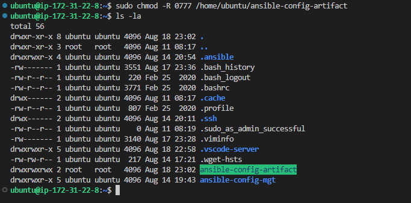

### ANSIBLE REFACTORING AND STATIC ASSIGNMENTS (IMPORTS AND ROLES)

* In this project I will continue working with ansible-config-mgt repository and will make some improvements of the existing  code.  Refactor an exiting Ansible code, create assignments, and use the imports functionality. Imports allow to effectively re-use previously created playbooks in a new playbook – it allows to organize  tasks and reuse them when needed.

### Step 1 – Jenkins job improvement

* Before I begin, I made some changes to the Jenkins job – by installing  Copy Artifact plugin.

* went to Jenkins web console -> Manage Jenkins -> Manage Plugins -> on Available tab search for Copy Artifact and installed the plugin without restarting Jenkins

*  created a new directory called ansible-config-artifact – This new directory will store  all artifacts after each build.

` sudo mkdir /home/ubuntu/ansible-config-artifact `

* Changed permissions to the directory, so Jenkins could save files there – 

` chmod -R 0777 /home/ubuntu/ansible-config-artifact `

* created a new freestayle job and named it save_artifacts, this project will be triggered when jenkins build and save each builds in it

* Ran a test build by making a code change in git hub

### REFACTOR ANSIBLE CODE BY IMPORTING OTHER PLAYBOOKS INTO SITE.YML
### Step 2 – Refactor Ansible code by importing other playbooks into site.yml

* Before starting to refactor the codes, I pulled down the latest code from master (main) branch, and created a new branch, name it refactor.

### However, breaking tasks up into different files is an excellent way to organize complex sets of tasks and reuse them.

## Importing other playbooks.

* Within playbooks folder, I created a new file and name it site.yml – This file will now be considered as an entry point into the entire infrastructure configuration. Other playbooks will be included here as a reference. In other words, site.yml will become a parent to all other playbooks that will be developed. Including common.yml that I created previously. 

* I also created a new folder in root of the repository and name it static-assignments. The static-assignments folder is where all other children playbooks will be stored. This is merely for easy organization of my work. 

* Moved common.yml1 file into the newly created static-assignments folder.

* Inside the site.yml file, imported common.yml1 playbook with the below codes.

* The code above uses built in import_playbook Ansible module.

* My folder structure should look like the below

* Ran ansible-playbook command against the dev environment, Since wireshark is already installed I created another playbook under static-assignments and name it common-del.yml. In this playbook, configured  deletion of wireshark utility.

* updated site.yml with - import_playbook: ../static-assignments/common-del.yml  and ran it against dev servers:

* changed dir into ansible-config-mgt in order to run the ansible playbook 

* first I pinged all my servers to see if i can reach them.

`  cd /home/ubuntu/ansible-config-mgt `

` ansible-playbook -i inventory/dev.yml /home/ubuntu/playbooks/site.yml `

* verified  wireshark is deleted on all the servers by running wireshark --version and which wireshark command 

### CONFIGURING UAT WEBSERVERS WITH A ROLE ‘WEBSERVER’

### Step 3 – Configure UAT Webservers with a role ‘Webserver’

* I will spin up 2 new Web Servers as uat and use a dedicated role to make the configuration reusable.

* Launched 2 fresh EC2 instances using RHEL 8 image, and them named  ccordingly as – Web1-UAT and Web2-UAT.

* To create a role, I must create a directory called roles/, relative to the playbook file or in /etc/ansible/ directory.
There are two ways how you can create this folder structure:

* I can use an Ansible utility called ansible-galaxy inside ansible-config-mgt/roles directory or I need to create roles directory upfront

` mkdir roles `

` cd roles `

` ansible-galaxy init webserver `

The entire folder structure should look like below,

* I updated my inventory ansible-config-mgt/inventory/uat.yml file with IP addresses of my 2 UAT Web servers

* I ensured I used ssh-agent to ssh into the Jenkins-Ansible instance just as I have done in project 11;

* In /etc/ansible/ansible.cfg file uncomment roles_path string and provide a full path to your roles directory roles_path    = /home/ubuntu/ansible-config-mgt/roles, so Ansible could know where to find configured roles.

 * changed dir to tasks directory, and within the main.yml file, pasted the below code.

* The above code Installed and configured Apache (httpd service)
Cloned Tooling website from GitHub https://github.com/babalola1234/tooling.git and the tooling website code is deployed to /var/www/html on each of 2 UAT Web server and Made sure httpd service is started

### REFERENCE WEBSERVER ROLE
### Step 4 – Reference ‘Webserver’ role

* Within the static-assignments folder, I created a new assignment for uat-webservers - uat-webservers.yml. This is where I will reference the role. the below codes were pasted 

* I need to reference the entry point to the  ansible configuration in the site.yml file. Therefore, the below code is pasted inside site.yml.

* So, I have this in site.yml below

### Step 5 – Commit & Test

* Commited all changes, created a Pull Request and merge them to my main branch,  webhook triggered two consequent Jenkins jobs, they ran successfully and copied all the files to my Jenkins-Ansible server into /home/ubuntu/ansible-config-mgt/ directory.

* ran the playbook against my uat inventory below

` ansible-playbook -i /home/ubuntu/ansible-config-mgt/inventory/uat.yml /home/ubuntu/ansible-config-mgt/playbooks/site.yml `

* below are the Jenkins job and artifacts 

` http://18.223.114.31/index.php `

` http://18.222.17.118/index.php `

